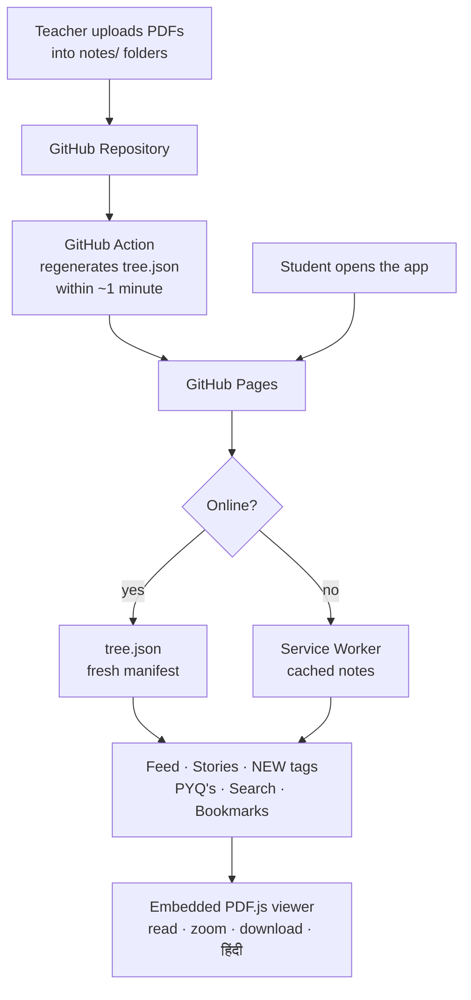
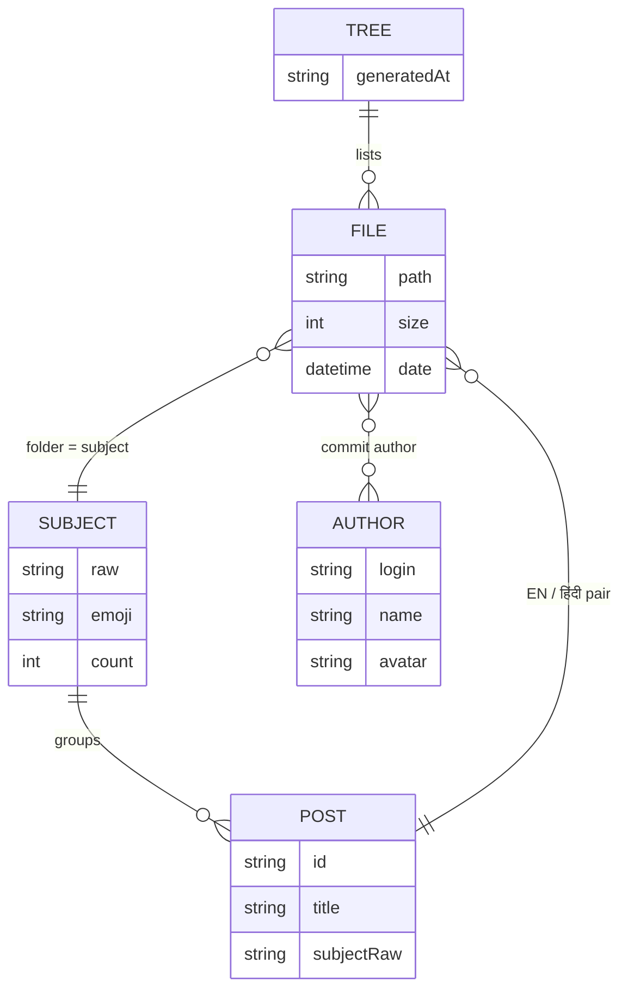
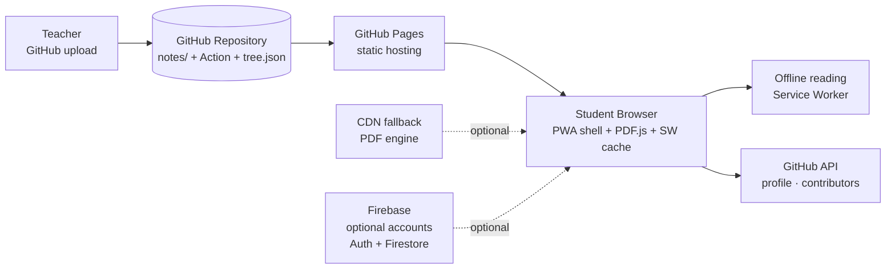
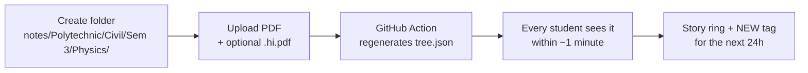
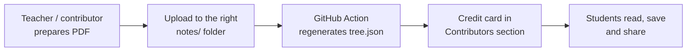

<table>
<tr>
<td></td>
<td>

# Notes Sathi
Broadcast notes blog — teacher uploads PDFs, students read them. English + हिंदी, stories, PYQ's, optional student accounts (Google one-tap or e-mail) with ✅ read-ticks & ❤️ reactions — free for every student.

</td>
</tr>
</table>

<p>
  
  
  
</p>

A free app for every student of **Satpuda College of Engineering and Polytechnic** — teachers publish notes by simply uploading PDFs to a GitHub repository; the app turns them into a beautiful, social-media-style notes blog. Reading needs no login, ever — an optional student account (one-tap Google or e-mail + password → admin-approved) additionally unlocks ✅ read-ticks, ❤️ reactions and "who read" lists on Firebase's free tier. Notes stay free for every student, always.

---
> **Simple • Broadcast • Free Forever • Notes Management**

Notes Sathi is a lightweight, mobile-first notes platform with **Instagram-style stories for fresh uploads (24h)**, a fully **embedded PDF viewer** (pages, pinch-zoom, download), a **file manager**, **live search**, **semester onboarding**, a **PYQ's quick-access sheet**, **bookmarks**, **WhatsApp sharing**, **optional student accounts** (Google one-tap or e-mail → ✅ read-ticks, ❤️ helpful reactions, who-read sheets, two-letter avatars), and **English + हिंदी** versions of every note — installable as an app and readable offline.

It is built for classroom workflows: the teacher uploads, every student receives — publishing requires no code, ever.

---

# Notes Sathi

<p align="center">
  
</p>

<p align="center">
  <strong>Teacher uploads. Students read. Simple.</strong><br>
  Fresh uploads become stories, files stay organised, PYQ's stay one tap away.
</p>

<p align="center">
  <a href="https://vinaysoni-in.github.io/Notes-Sathi/">
    
  </a>
  &nbsp;
  <a href="https://wa.me/918989031351">
    
  </a>
</p>

<p align="center">
  <sub>Notes • PDF • English + हिंदी • Stories • PYQ's • Semester • Accounts • Offline</sub>
</p>

---

## ✨ Features

| | |
|---|---|
| 📤 **Upload dashboard** | Teachers publish from inside the app — sign in once with a GitHub token, pick semester + subject, drag & drop PDFs; the dashboard uploads to the repo directly (with progress, EN/हिंदी tagging and overwrite handling) |
| 📰 **Broadcast feed** | Every uploaded PDF becomes a blog post — newest first, grouped by month |
| 🌀 **Stories (24h)** | Fresh uploads appear as Instagram-style story rings; watching turns them grey; they fade after 72h |
| 🆕 **NEW tags (24h)** | Posts uploaded within 24 hours carry a pulsing NEW badge — it expires automatically |
| 📌 **Permanent stories** | *Official* (college website) and *Important* quick-link rings that never fade — URLs editable in `notes/config.json` |
| 📖 **Embedded PDF viewer** | PDF.js inside the app on every device (even Android Chrome) — pages, pinch / ctrl+scroll / button zoom up to 400%, buttery-smooth, download & open-in-tab |
| 🎓 **Semester onboarding** | First open → pick your semester (Sem 1–8) + accept the Terms/Privacy paragraph; the app opens on that semester by default |
| 📝 **PYQ's button** | Floating button (Home tab) with previous year question papers — per semester, newest first |
| 🔍 **Search** | Live search bar — name, subject or filename; combines with subject chips |
| 🗂 **Files tab** | Every file grouped by subject, newest uploads at the top; switch to flat 🕒 Newest or 🔤 A–Z |
| 🔖 **Bookmarks** | Save any note for quick revision — stored on the device |
| ✍️ **Contributors** | Everyone who uploads gets a card with their contributed notes and GitHub avatar |
| 👤 **Student accounts (optional)** | Two ways to join: e-mail + password, or one-tap **Continue with Google** — then name, phone & DPDP consent → admin approves → community unlocks; passwords hashed by Google Firebase, never visible to anyone; reading always stays login-free |
| ✅ **Read-ticks & reactions** | Opening a note auto-ticks it (permanent, cross-device); ❤️ mark notes helpful; "who read" lists with two-letter avatars in name-hashed colours |
| 📤 **Student note submissions** | "Send on WhatsApp" button in the login window opens a pre-filled message (name, program, branch, semester) — the student just attaches the PDF; the teacher publishes it with the student's name |
| ⏳ **In-app admin approvals** | The owner approves/rejects pending students right from the app — every sign-up listed with name, phone & e-mail, one-tap approve (double-tap reject) — no console needed |
| ⚡ **Fast, unbreakable login** | Animated-gradient Login pill appears instantly; the form accepts typing while Firebase loads in the background; 15-second timeout with retry — smooth even on weak college networks |
| 🏅 **Student credit badges** | Student-submitted notes (WhatsApp → teacher publishes `Unit-1.Priya Sharma.pdf`) automatically get a golden **✍️ By Priya Sharma** badge |
| 🌓 **Dark mode** | One tap, remembered |
| 💬 **WhatsApp sharing** | Share any note straight to a chat |
| 🙋 **Need help?** | Instagram + WhatsApp contact buttons below the profile |
| 💾 **Offline PWA** | Installable; service worker keeps the app and read notes available offline |

## 🧭 Sections

| Home | Files | Search | Profile |
|---|---|---|---|
| Feed, stories, PYQ's | All files by subject | Find any note | Teacher, contributors, help |

## 📱 Screenshots

<table>
<tr>
<td align="center"><br><sub>Application Onboarding</sub></td>
<td align="center"><br><sub>Home — Stories & Feed</sub></td>
<td align="center"><br><sub>Login/Account Section</sub></td>
</tr>
<tr>
<td align="center"><br><sub>Embedded PDF Viewer</sub></td>
<td align="center"><br><sub>About/Help Section</sub></td>
<td align="center"><br><sub>Teacher Dashboard</sub></td>
</tr>
</table>

## 🛠️ Tech Stack

Plain HTML, CSS & JavaScript — no framework required.

`GitHub Pages` · `GitHub Actions` · `GitHub Trees API` · Service Worker · Web App Manifest · PDF rendering by [Mozilla's PDF.js](https://github.com/mozilla/pdf.js) (Apache 2.0) · `localStorage` · optional accounts: `Firebase` (Auth + Firestore, Spark free tier)

## 🗂️ File Structure

```text
Notes-Sathi/
│
├── index.html                      # The entire app (UI + logic)
├── manifest.json                   # PWA config — name, icons, theme
├── sw.js                           # Service worker (installable + offline)
├── tree.json                       # Auto-generated note manifest (GitHub Action)
├── icon-192.png / icon-512.png     # App icons
├── legal/                          # Terms, Privacy Policy & grievance docs (.txt, DPDP-aligned)
├── firestore.rules                 # Firestore security rules — approval gating, own-data-only writes
├── firebase-setup-guide.md         # ~10-minute Firebase console setup (₹0, no card)
├── ACCOUNTS-GO-LIVE-GUIDE.md       # Activation, admin UID, testing, daily approvals & rollback
├── ADMIN-SETUP-STEPS.md            # Click-by-click admin setup + enabling Google sign-in
├── images/                         # Permanent story logos (square images)
├── screenshots/                    # README screenshots
├── pdf.min.js / pdf.worker.min.js  # Embedded PDF viewer engine (optional — CDN fallback built in)
├── standard_fonts/  cmaps/         # PDF.js font & Indic text support (optional)
├── .github/workflows/generate-tree.yml   # Regenerates tree.json on every upload
├── notes/
│   ├── config.json                 # Site config: title, names, story URLs, emojis
│   └── Polytechnic/                # Program (Diploma) — B.Tech coming soon
│       ├── Computer Science and Engineering/   # RGPV scheme · Sem 1–6 · all subject folders
│       ├── Electrical Engineering/              # RGPV scheme · Sem 1–6 · all subject folders
│       ├── Civil Engineering/                   # RGPV scheme · Sem 1–6 · all subject folders
│       └── Mechanical Engineering/              # RGPV scheme · Sem 1–6 · all subject folders
│           └── e.g. Sem 3/Thermal Engineering-I/Unit-1.pdf + Unit-1.hi.pdf
│               (every subject folder already exists with a .gitkeep placeholder —
│                drop PDFs inside; the placeholder is harmless and can stay)
└── README.md                       # This file
```

## 🔄 How It Works



## 🧱 Data Model



## 🏗️ Architecture



## 📤 Upload Dashboard (easiest way)

Open the **Upload** tab in the app → sign in once with a GitHub **fine-grained personal access token** (*Settings → Developer settings → Fine-grained tokens → Generate*; repository access: **only this repo**; permissions: **Contents: Read and write**) → then publishing is just:

1. Pick **program** (Polytechnic — B.Tech coming soon), **branch**, **semester** and **subject** — all required, so uploads always land in `notes/Polytechnic/[Branch]/Sem N/[Subject]/` (never the notes root). The **Subject dropdown updates automatically** with the folders that already exist under the picked Branch + Semester — and if none exist yet, it offers every subject so the teacher can create the first one
2. **Drag & drop** your PDFs — English and हिंदी versions are auto-tagged (toggle per file if needed)
3. Tap **Upload all** — live progress, and if a file already exists it's **updated** automatically
4. Students see the notes within ~1 minute

The token stays in the teacher's browser only and can be remembered per device (optional) — sign out on shared computers.

## 📝 Publishing Notes (manual alternative)

**Upload = publish.** Add files via *Add file → Upload files* into the right folder:

| Upload into | Students see |
|---|---|
| `notes/Polytechnic/Civil Engineering/Sem 3/Building Construction/Unit-1.pdf` | Only **Civil** Semester-3 students — Building Construction subject |
| `notes/Polytechnic/Civil Engineering/Sem 3/Building Construction/Unit-1.hi.pdf` | The same post with a 📕 हिंदी switch |
| `notes/Polytechnic/.../Unit-1.Priya Sharma.pdf` | The post gets a golden **✍️ By Priya Sharma** badge — student credit (works with `.hi.pdf` too) |
| `notes/Polytechnic/Civil Engineering/Sem 3/PYQ/…` | PYQ's sheet for Civil Semester-3 students (never in the feed or subject chips) |
| `notes/Sem 3/Physics/…` (legacy) | College-wide — every branch, Semester 3 |
| `notes/Any-File.pdf` (legacy root) | College-wide — every branch, every semester |



**Programs & branches:** students first pick **Polytechnic** (B.Tech shows *Coming soon*) and then their branch — Civil, Mechanical, Electrical, Mining & Mine Surveying, or Computer Science. Every page (feed, Files, search, stories, PYQ's, uploads) follows that choice. The **full RGPV diploma scheme is built in**: 205 subject folders across the 4 branches (Sem 1–6) are pre-created in the repo, and the Upload Dashboard lists exactly those subjects for the picked branch + semester. Folder names are matched forgivingly (`civil engineering`, `CSE`, `Mining & Mine Surveying` all work).

*Site name, teacher name, college, permanent-story links and subject emojis are configured in `notes/config.json`. Subject chips and group labels always show the clean subject name (e.g. **Physics**) — semester folders and PYQ folders are never displayed as subjects. Language badges: 📘 English · 📕 हिंदी.*

## 🔐 Student Accounts (optional)

Reading is — and always will be — **100% login-free**. Students who want the community features can optionally join — two ways:

- **E-mail + password** — display name, e-mail, phone, password (8+ chars) + DPDP consent
- **Continue with Google** — one tap with their college Google account; since Google doesn't share phone numbers, first-timers complete a tiny "🎯 Finish your account" card (name pre-filled + phone + consent)

Both paths then work identically:

1. **Sign up** (either method) → account starts `pending`
2. **Admin approval** — the owner approves from **inside the app** (⏳ Pending approvals: every student's name, phone & e-mail listed, one-tap approve) or from the Firebase Console
3. **Unlocked:** ✅ read-ticks (automatic, permanent, cross-device) · ❤️ helpful reactions · 📖 "who read" lists (recent readers with two-letter avatars) · a small profile sheet

📤 **Student note submissions** live in the same window: a "Send on WhatsApp" button opens a pre-filled message (name, program, branch, semester) — the student attaches the PDF, the teacher publishes it as `Unit-1.Priya Sharma.pdf`, and the post carries the golden **✍️ By Priya Sharma** badge. No storage bucket, no cost, full moderation.

⚡ **Built for college networks:** the animated Login pill appears instantly, the form accepts typing while Firebase loads in the background, nothing ever hangs (15-second timeout + retry), and typed details are never lost.

Data stored per student: **name, e-mail, phone, reactions — nothing else** (see `legal/02-PRIVACY-POLICY.txt`). Passwords are hashed by Google Firebase and can never be seen or recovered by anyone, including the owner. Everything runs on the **Firebase Spark free tier** (50K reads / 20K writes per day) — ₹0/month, no credit card — and the Firestore security rules (`firestore.rules`) make self-approval and writing other students' data impossible, server-side. `FB_CONFIG = null` in `index.html` switches the entire system off again.

**Setup guides:** `firebase-setup-guide.md` (console basics) → `ACCOUNTS-GO-LIVE-GUIDE.md` (activation & testing) → `ADMIN-SETUP-STEPS.md` (click-by-click admin setup + enabling Google sign-in).

## 🚧 Production Status

**Live** — in daily use by students of Satpuda College of Engineering and Polytechnic.

**Ready:** broadcast feed · stories + NEW tags · embedded PDF viewer (all devices) · semester onboarding & filtering · PYQ's sheet · search · files manager · bookmarks · offline PWA · permanent quick links · optional student accounts — e-mail + password & Google one-tap (approval-gated reactions & read-ticks) · in-app admin approvals · WhatsApp note submissions · golden student-credit badges
**Optional:** self-hosted PDF engine (works from CDN today) · richer analytics-free theming

> Students should always verify content with the official syllabus and their teachers — Notes Sathi is a study aid, not an official source.

## 🗺️ Roadmap

- [ ] **Notice board section & announcements**
- [ ] **Timetable & syllabus**

## 🤝 Contribution Flow

Notes contributions are the heart of Notes Sathi — teachers and classmates add PDFs directly (see *Publishing Notes* above); the app code itself is proprietary.


---

<p align="center">
<sub>
Notes Sathi is provided "as is" without warranty of any kind — the owner and contributors are not liable for the accuracy, completeness or consequences of its content. Notes are not an official publication of any institution — always verify with your official syllabus and teachers. Notes are served directly from the institution's public GitHub repository; student preferences (semester, theme, bookmarks) are stored only in each student's own browser, and optional account data (name, e-mail, phone, reactions) is stored with Google Firebase as described in `legal/02-PRIVACY-POLICY.txt`. This project is proprietary software — © 2026 Vinay Soni, all rights reserved; copying or redistributing the app is not permitted. Notes stay free for every student, always.
</sub>
</p>

<p align="center">
<sub>
Made with ❤️ by <a href="https://github.com/VinaySoni-IN">Vinay Soni</a> · A <b>Satpuda College of Engineering and Polytechnic</b> initiative 🎓
</sub>
</p>
