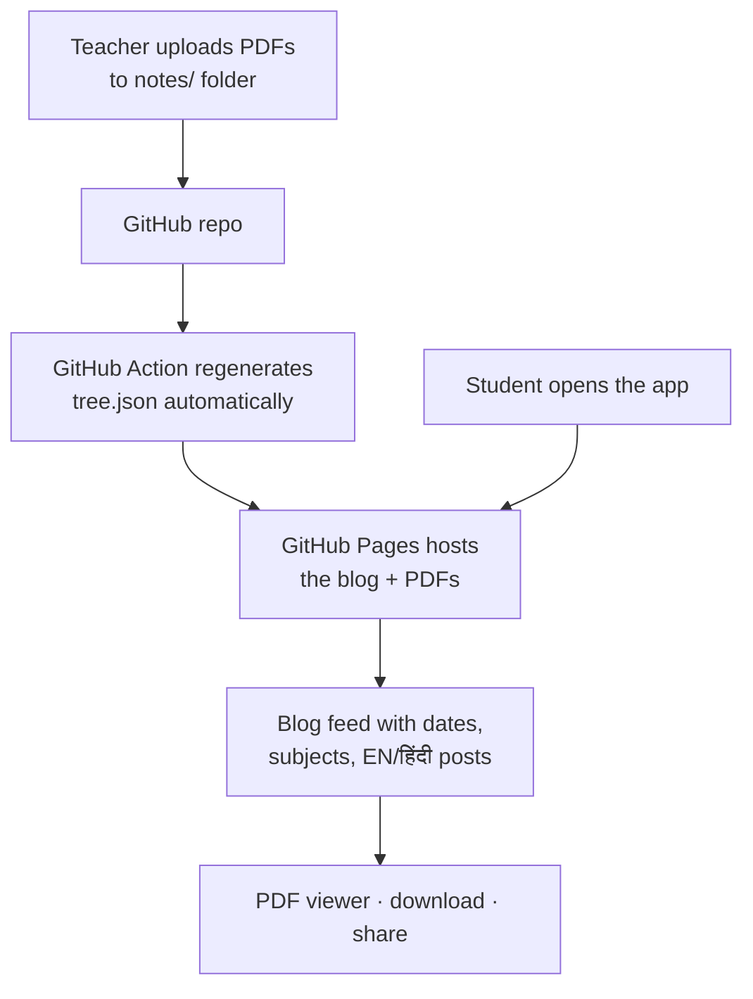

<table>
<tr>
<td></td>
<td>

# Notes Sathi
A college notes blog — teacher publishes PDFs, students read, download & share.

</td>
</tr>
</table>

<p>
  
  
  
</p>

**Notes Sathi** — the notes app of **Satpuda College of Engineering and Polytechnic** 🎓 — turns a plain GitHub repository into a beautiful notes blog for your class — with a social-media feel. You upload PDFs into folders; the app broadcasts them to your students as a clean blog with **Instagram-style stories for fresh uploads (24h)**, a built-in **PDF viewer**, a full **file manager**, **bookmarks**, **downloads** and **WhatsApp sharing** — with **English + हिंदी** versions of every note.

No server, no database, no cost. **Your files are the app.**

---

## ✨ How it works

| | |
|---|---|
| 📁 **Folders are subjects** | `notes/Physics/`, `notes/Mathematics/` — create a subject by creating a folder |
| 📄 **Files are posts** | Drop a PDF → it becomes a blog post, sorted by upload date |
| 🌀 **Stories (24h)** | Uploads from the last 24h appear as Instagram-style gradient story circles; watching one turns its ring gray; they fade out after 72h |
| ✍️ **Contributors** | Everyone who uploads notes gets their own card, with their contributed notes listed separately (first 3 + "Show more") — plus author avatars on every post card |
| 🐙 **GitHub-synced hero** | The masthead shows live repo data — ⭐ stars, 🍴 forks, real update time, publisher avatar & name |
| 🆕 **NEW tags (24h)** | Posts uploaded within 24 hours carry a pulsing NEW badge — it expires automatically |
| 🔖 **Saved notes** | Students bookmark any note; saved notes get their own filter chip |
| 🌐 **English + हिंदी pairing** | `Unit-1.pdf` (English) + `Unit-1.hi.pdf` (Hindi translation) = one post with a language switch |
| 👤 **GitHub-powered profile** | The About tab shows the publisher's live GitHub profile — avatar, bio, followers, repos |
| 📖 **Built-in PDF viewer** | Read right inside the app — no download needed |
| 🗂 **Files tab** | Every file with type icons, sizes, dates; sort by newest / A–Z / subject |
| ⬇️ **One-tap download** | Per note or per file, for offline reading |
| 📲 **WhatsApp sharing** | Send any note to class groups in one tap |
| 🔍 **Search + filters** | Instant search across notes, subjects and file names, with PDF/Docs/Images filters |
| 🌙 **Dark mode** | For late-night study |
| 📴 **Offline (PWA)** | Installable; cached PDFs open without internet |

## 🚀 Deploy (one-time, ~5 minutes)

1. **Create a public repository** (e.g. `Notes-Sathi`) and copy all files from this project into it. Minimum required: `index.html`, `sw.js`, `manifest.json`, `icon-192.png`, `icon-512.png`, `.github/workflows/generate-tree.yml` + your `notes/` folder. *(The PDF viewer engine — `pdf.min.js`, `pdf.worker.min.js`, `standard_fonts/`, `cmaps/` — is optional: if these files are missing, the app automatically loads the engine from a CDN and caches it for offline use. To fully self-host, upload them too — note GitHub's web uploader allows max 100 files per batch, so upload `cmaps/` in two batches or use git.)*
2. **Enable GitHub Pages**: repo → *Settings → Pages → Source: Deploy from branch → `main` / root* → Save.
3. Open `https://<your-username>.github.io/Notes-Sathi/` — done. Your blog is live! 🎉
4. Make sure the included workflow (`.github/workflows/generate-tree.yml`) is present — it keeps the note list updated automatically (with hour-precise timestamps for the 24h stories). (Repo → *Actions* → enable workflows if asked.)
5. ⚠️ **Only upload real PDF files** — placeholder/empty files (a few bytes) created via *Add file → Create new file* cannot be opened. Upload actual `.pdf` exports or scans.

**Custom domain?** Open `index.html`, set `CONFIG.owner` and `CONFIG.repo` manually near the top of the script.

**Keeping the code private?** This project is closed-source. Free GitHub Pages requires a *public* repo — if you want the repository private, either upgrade to GitHub Pro (private-repo Pages) or host the same files on any static host (Netlify, Cloudflare Pages) and keep the repo private.

## 📝 Publish notes (teachers — no code, ever)

1. Open your repo on GitHub → go into the **`notes/`** folder.
2. **Add file → Upload files** → drop your PDFs → commit.
3. New subject? Just upload into a new folder: `notes/Chemistry/...`
4. Multiple teachers? Everyone commits to the same repo — the app credits each contributor's notes automatically (GitHub username + avatar).
4. Within a minute the blog updates itself.

### File naming for English + हिंदी

| Files you upload | What students see |
|---|---|
| `notes/Physics/Unit-1.pdf` | Post "Unit 1" · English badge |
| `notes/Physics/Unit-1.hi.pdf` | Same post gains a **हिंदी** badge + language switch |
| `notes/Physics/Unit-2.pdf` | A new post |

Tips: `Unit-1`, `Unit-2` … `Unit-10` sort naturally; avoid the `#` character in names; images (`.png`, `.jpg`) also work as notes.

### Customize the blog — `notes/config.json`

```json
{
  "blogTitle": "Notes Sathi",
  "tagline": "Class notes — English + हिंदी अनुवाद, free for every student",
  "teacherName": "Prof. Vinay Soni",
  "collegeName": "Satpuda College of Engineering and Polytechnic",
  "subjectEmojis": { "Physics": "🧲", "Mathematics": "📐" }
}
```

## 🧠 Architecture



**Data sources, in order of priority:**
1. `tree.json` — auto-generated by the GitHub Action (fast, no rate limits, includes real upload dates)
2. GitHub Trees API — used if `tree.json` is missing (auto-detects the repo from the `*.github.io` URL)
3. Last-visit cache — offline reading
4. Built-in demo — when opened as a local file (shows how the blog will look)

## 🗂️ File Structure

```text
Notes-Sathi/
│
├── index.html                      # The entire app (UI + logic)
├── manifest.json                   # PWA config
├── sw.js                           # Service worker — offline PDFs
├── tree.json                       # Auto-generated note manifest (Action)
├── icon-192.png / icon-512.png     # App icons
├── pdf.min.js / pdf.worker.min.js  # Embedded PDF viewer (Mozilla PDF.js) — optional, CDN fallback built in
├── standard_fonts/                 # PDF.js font data (non-embedded fonts) — optional, CDN fallback built in
├── cmaps/                          # PDF.js cmaps (Indic/CJK text support) — optional, CDN fallback built in
├── .github/workflows/generate-tree.yml
│
└── notes/                          # 📚 YOUR NOTES LIVE HERE
    ├── config.json                 # Blog title, your name, emojis
    ├── Physics/                    # Subject = folder
    │   ├── Unit-1-Motion.pdf       # English note
    │   └── Unit-1-Motion.hi.pdf    # Hindi translation
    ├── Mathematics/
    └── Computer-Science/
```

## 🛠️ Tech Stack

Plain HTML, CSS & JavaScript — one self-contained `index.html`, zero frameworks, zero dependencies.

`GitHub Pages` · `GitHub Actions` · `GitHub Trees API` · Service Worker · Web App Manifest · PDF rendering by [Mozilla's PDF.js](https://github.com/mozilla/pdf.js) (Apache 2.0)

## 🗺️ Roadmap

- [ ] Student reaction/confirmation ("I've read this ✓")
- [ ] Page-count badges on PDF posts
- [ ] Subject cover images
- [ ] Semester grouping (nested folders support is already built in)
- [ ] F-Droid-style one-tap install page

---

<p align="center">
<sub>
© 2026 **Vinay Soni**. All rights reserved. Notes Sathi is proprietary software, closed under its author — copying or redistributing the app is not permitted. All notes are served directly from the institution's repository — nothing else is ever uploaded anywhere, and notes stay free for every student, always.
</sub>
</p>

<p align="center">
<sub>
Made with ❤️ by <a href="https://github.com/VinaySoni-IN">Vinay Soni</a> · A <b>Satpuda College of Engineering and Polytechnic</b> initiative 🎓<br>Notes stay free for every student, always.
</sub>
</p>
