<table>
<tr>
<td>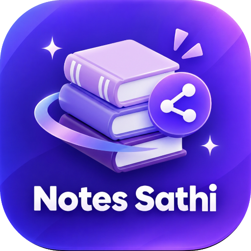</td>
<td>

# Notes Sathi
Broadcast notes blog — teacher uploads PDFs, students read them. English + हिंदी, stories, PYQ's — free for every student.

</td>
</tr>
</table>

<p>
  
  
  
</p>

A free app for every student of **Satpuda College of Engineering and Polytechnic** — teachers publish notes by simply uploading PDFs to a GitHub repository; the app turns them into a beautiful, social-media-style notes blog. No login, no server — notes stay free for every student, always.

---
> **Simple • Broadcast • Free Forever • Notes Management**

Notes Sathi is a lightweight, mobile-first notes platform with **Instagram-style stories for fresh uploads (24h)**, a fully **embedded PDF viewer** (pages, pinch-zoom, download), a **file manager**, **live search**, **semester onboarding**, a **PYQ's quick-access sheet**, **bookmarks**, **WhatsApp sharing**, and **English + हिंदी** versions of every note — installable as an app and readable offline.

It is built for classroom workflows: the teacher uploads, every student receives — publishing requires no code, ever.

---

# Notes Sathi

<p align="center">
  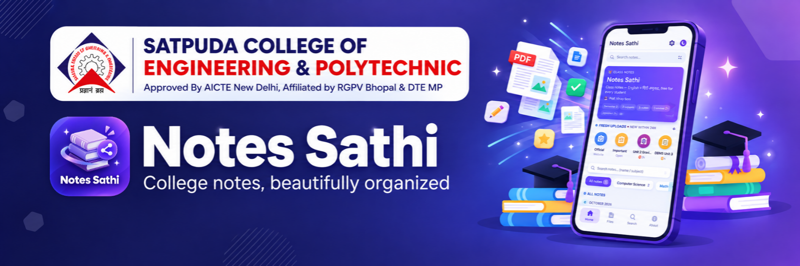
</p>

<p align="center">
  <strong>Teacher uploads. Students read. Simple.</strong><br>
  Fresh uploads become stories, files stay organised, PYQ's stay one tap away.
</p>

<p align="center">
  <a href="https://vinaysoni-in.github.io/Notes-Sathi/">
    
  </a>
  &nbsp;
  <a href="https://wa.me/918989031351">
    
  </a>
</p>

<p align="center">
  <sub>Notes • PDF • English + हिंदी • Stories • PYQ's • Semester • Offline</sub>
</p>

---

## ✨ Features

| | |
|---|---|
| 📰 **Broadcast feed** | Every uploaded PDF becomes a blog post — newest first, grouped by month |
| 🌀 **Stories (24h)** | Fresh uploads appear as Instagram-style story rings; watching turns them grey; they fade after 72h |
| 🆕 **NEW tags (24h)** | Posts uploaded within 24 hours carry a pulsing NEW badge — it expires automatically |
| 📌 **Permanent stories** | *Official* (college website) and *Important* quick-link rings that never fade — URLs editable in `notes/config.json` |
| 📖 **Embedded PDF viewer** | PDF.js inside the app on every device (even Android Chrome) — pages, pinch / ctrl+scroll / button zoom up to 400%, buttery-smooth, download & open-in-tab |
| 🎓 **Semester onboarding** | First open → pick your semester (Sem 1–8) + accept the Terms/Privacy paragraph; the app opens on that semester by default |
| 📝 **PYQ's button** | Floating button (Home tab) with previous year question papers — per semester, newest first |
| 🔍 **Search** | Live search bar — name, subject or filename; combines with subject chips |
| 🗂 **Files tab** | Every file grouped by subject, newest uploads at the top; switch to flat 🕒 Newest or 🔤 A–Z |
| 🔖 **Bookmarks** | Save any note for quick revision — stored on the device |
| ✍️ **Contributors** | Everyone who uploads gets a card with their contributed notes and GitHub avatar |
| 🌓 **Dark mode** | One tap, remembered |
| 💬 **WhatsApp sharing** | Share any note straight to a chat |
| 🙋 **Need help?** | Instagram + WhatsApp contact buttons below the profile |
| 💾 **Offline PWA** | Installable; service worker keeps the app and read notes available offline |

## 🧭 Sections

| Home | Files | Search | Profile |
|---|---|---|---|
| Feed, stories, PYQ's | All files by subject | Find any note | Teacher, contributors, help |

## 📱 Screenshots

<table>
<tr>
<td align="center">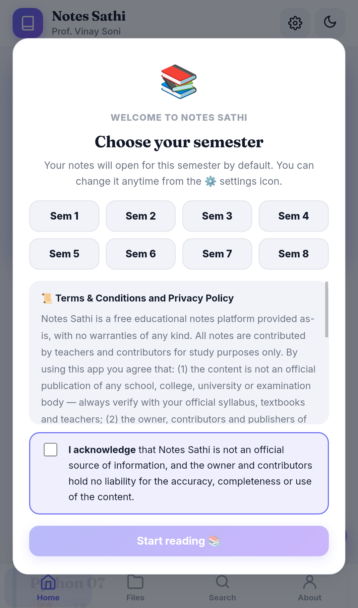<br><sub>Semester onboarding</sub></td>
<td align="center">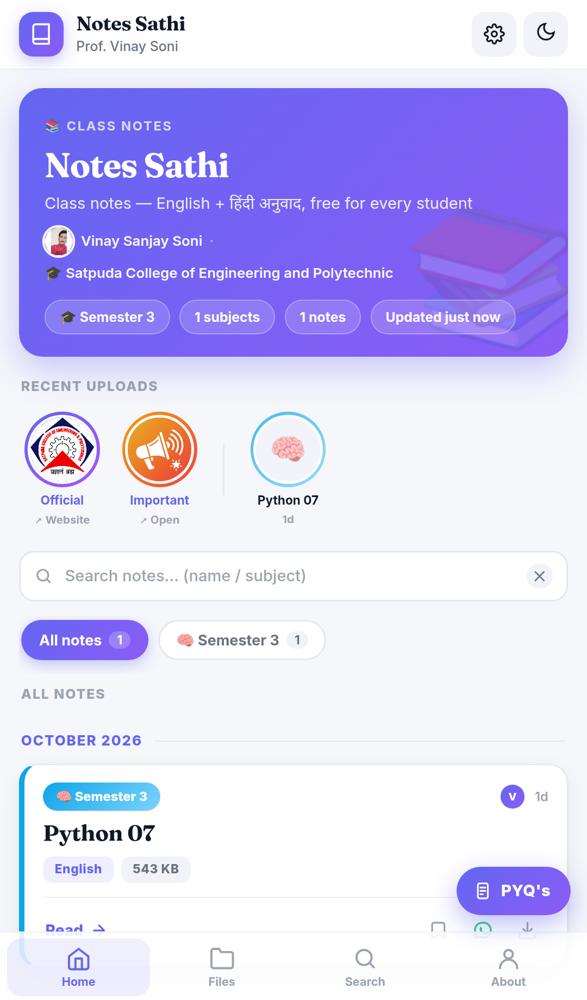<br><sub>Home — stories & feed</sub></td>
<td align="center">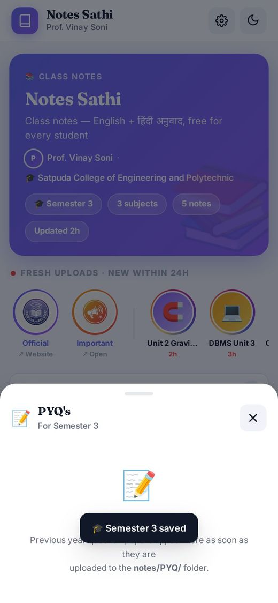<br><sub>PYQ's sheet</sub></td>
</tr>
<tr>
<td align="center">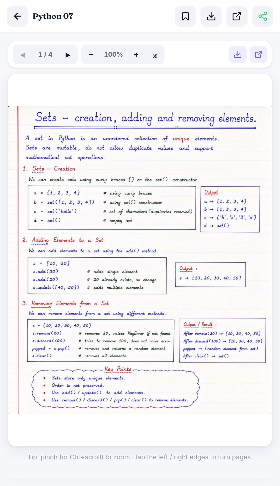<br><sub>Embedded PDF viewer</sub></td>
<td align="center">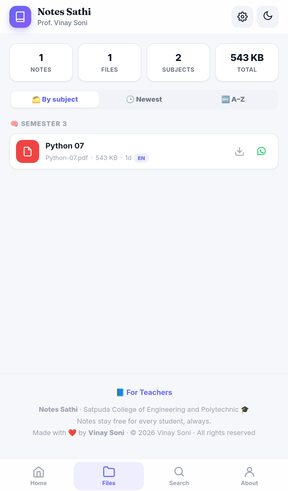<br><sub>Files by subject</sub></td>
<td align="center">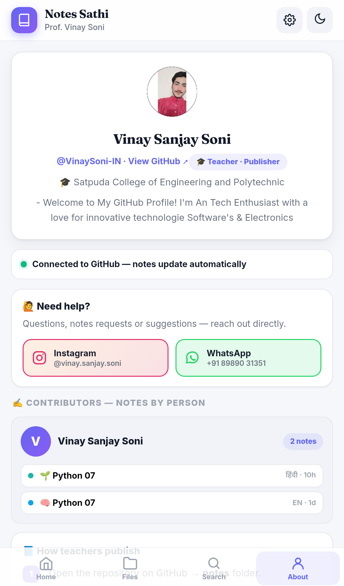<br><sub>Profile & help</sub></td>
</tr>
</table>

## 🛠️ Tech Stack

Plain HTML, CSS & JavaScript — no framework required.

`GitHub Pages` · `GitHub Actions` · `GitHub Trees API` · Service Worker · Web App Manifest · PDF rendering by [Mozilla's PDF.js](https://github.com/mozilla/pdf.js) (Apache 2.0) · `localStorage`

## 🗂️ File Structure

```text
Notes-Sathi/
│
├── index.html                      # The entire app (UI + logic)
├── manifest.json                   # PWA config — name, icons, theme
├── sw.js                           # Service worker (installable + offline)
├── tree.json                       # Auto-generated note manifest (GitHub Action)
├── icon-192.png / icon-512.png     # App icons
├── images/                         # Permanent story logos (square images)
├── screenshots/                    # README screenshots
├── pdf.min.js / pdf.worker.min.js  # Embedded PDF viewer engine (optional — CDN fallback built in)
├── standard_fonts/  cmaps/         # PDF.js font & Indic text support (optional)
├── .github/workflows/generate-tree.yml   # Regenerates tree.json on every upload
├── notes/
│   ├── config.json                 # Site config: title, names, story URLs, emojis
│   ├── Sem 3/Physics/…             # Semester → subject → notes
│   ├── Sem 5/PYQ/…                 # Per-semester question papers
│   └── PYQ/…                        # Common PYQ's (shown to everyone)
└── README.md                       # This file
```

## 🔄 How It Works

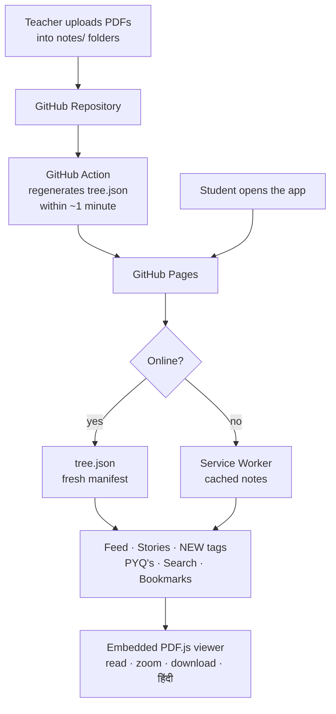

## 🧱 Data Model

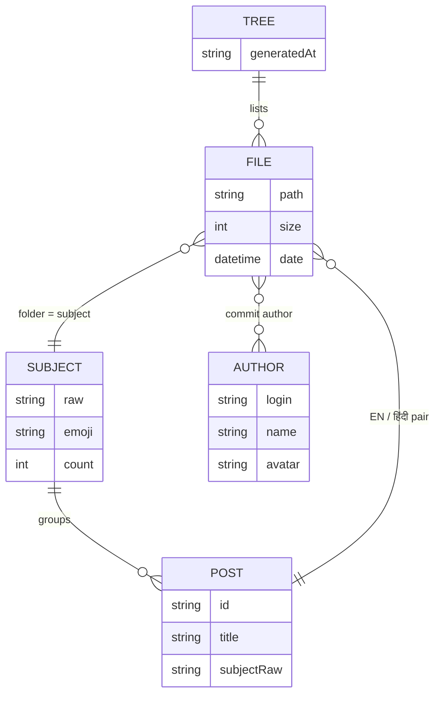

## 🏗️ Architecture

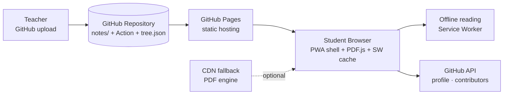

## 📝 Publishing Notes (teachers — no code, ever)

**Upload = publish.** Add files via *Add file → Upload files* into the right folder:

| Upload into | Students see |
|---|---|
| `notes/Physics/Unit-1.pdf` | A post in the Physics subject |
| `notes/Physics/Unit-1.hi.pdf` | The same post with a हिंदी switch |
| `notes/Sem 3/Physics/…` | Only Semester-3 students |
| `notes/Sem 3/PYQ/…` | PYQ's sheet for Semester-3 students |
| `notes/PYQ/…` | PYQ's sheet for everyone |

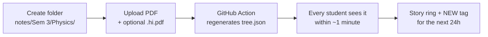

*Site name, teacher name, college, permanent-story links and subject emojis are configured in `notes/config.json`.*

## 🚧 Production Status

**Live** — in daily use by students of Satpuda College of Engineering and Polytechnic.

**Ready:** broadcast feed · stories + NEW tags · embedded PDF viewer (all devices) · semester onboarding & filtering · PYQ's sheet · search · files manager · bookmarks · offline PWA · permanent quick links
**Optional:** self-hosted PDF engine (works from CDN today) · richer analytics-free theming

> Students should always verify content with the official syllabus and their teachers — Notes Sathi is a study aid, not an official source.

## 🗺️ Roadmap

- [ ] Text search inside PDFs
- [ ] Per-subject offline download (ZIP)
- [ ] Notice board section (repo-driven announcements)
- [ ] Timetable & syllabus quick-cards
- [ ] More colleges / classes on one install

## 🤝 Contribution Flow

Notes contributions are the heart of Notes Sathi — teachers and classmates add PDFs directly (see *Publishing Notes* above); the app code itself is proprietary.

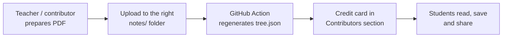
---

<p align="center">
<sub>
Notes Sathi is provided "as is" without warranty of any kind — the owner and contributors are not liable for the accuracy, completeness or consequences of its content. Notes are not an official publication of any institution — always verify with your official syllabus and teachers. Notes are served directly from the institution's public GitHub repository; student preferences (semester, theme, bookmarks) are stored only in each student's own browser. This project is proprietary software — © 2026 Vinay Soni, all rights reserved; copying or redistributing the app is not permitted. Notes stay free for every student, always.
</sub>
</p>

<p align="center">
<sub>
Made with ❤️ by <a href="https://github.com/VinaySoni-IN">Vinay Soni</a> · A <b>Satpuda College of Engineering and Polytechnic</b> initiative 🎓
</sub>
</p>
